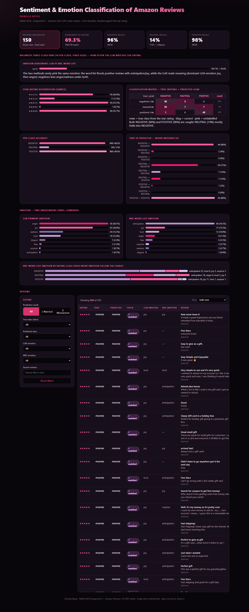

# MBAX 6418 — Assignment 1
# Sentiment & Emotion Classification of Amazon Reviews

**Daniela Reyes** · University of Colorado

This model classifies each review as **positive / neutral / negative**, detects the review's
**primary emotions**, and the predictions are **checked against the star rating** — but the
model never sees that rating.

**Data source:** Amazon Reviews '23, McAuley Lab (UC San Diego) —
<https://amazon-reviews-2023.github.io> · category file: `review_categories/Gift_Cards.jsonl.gz`
(152,410 gift-card reviews; the raw file is large and re-downloadable, so it is **not**
committed — results in this report are reproducible from the scripts below).

**Approach:** Classification and emotion are done by an LLM through an OpenAI-compatible
endpoint (Hermes Agent). A structured prompt (`prompt.py`) feeds the model the review's
**title and text only**. The **binary** sentiment prompt returns a single word
(`POSITIVE`/`NEGATIVE`); the **three-class** prompt returns a strict JSON answer
(`sentiment` + `emotion`). The star rating is applied **afterward**, purely to score the
predictions — it is never shown to the model.

All code, results, raw output, the dashboard, and screenshots live in the
[`MBAX-6418-Assignment-1/`](MBAX-6418-Assignment-1/) project folder (see the Files table).

---

## Files

> All files below are in the `MBAX-6418-Assignment-1/` folder.

| File | Role |
|---|---|
| `01_prepare_data.py` | Load + clean the Gift-Cards review file; build the "correct answer" from the rating |
| `prompt.py` | The reusable, structured LLM prompt (title+text → sentiment+emotion) and its parser |
| `llm_classify.py` | Runs the LLM over a chosen sample; scores predictions vs. the rating; saves raw output |
| `nrc_emotion.py` | Scores reviews against the NRC word list; compares it with the LLM emotion |
| `spot_check.py` | Step-1 sanity check on obvious reviews |
| `make_dashboard.py` | Generates the self-contained HTML dashboard (`dashboard/`) |
| `first_100_results.csv` | Scored output of the lopsided first-100 binary run (Step 2) |
| `balanced_results.csv` | Scored output of the balanced three-class run (Step 6) |
| `raw_output/balanced_run_raw_output.jsonl` | Raw LLM answers for the balanced run (one review per line) |
| `dashboard/Sentiment_Emotion_Dashboard.html` | The final dashboard (single file, works offline) |
| `screenshots/dashboard_screenshot.png` | The dashboard, captured |

---

## The Dashboard



---

## Findings

### 1. Why did the lopsided run look very accurate, and what did balancing change?

The first **100 reviews in file order** are rated highly at **93 positive and only 7 negative**.
It measured agreement between the LLM's text-based sentiment prediction and the star rating
derived from the review:

```
true\pred     NEGATIVE  POSITIVE   hit%
NEGATIVE            6         1   85.7%   (n=7)
POSITIVE            1        92   98.9%   (n=93)
```

To see the model's true behaviour I drew a **balanced** sample instead — roughly **50 of each
class** picked at random from the whole 152k file with a **fixed seed (42)** so the same set
reproduces. On that set agreement fell to **104/150 = 69.3%**:

```
true\pred     NEGATIVE  NEUTRAL  POSITIVE   hit%
NEGATIVE           48        2         0    96%   (n=50)
NEUTRAL            36        7         7    14%   (n=50)
POSITIVE            1        0        49    98%   (n=50)
```

**What balancing revealed:** the accuracy dropped from 98% to 69.3% once we neutralized the
ratings. The unbalanced data was the biggest weakness and shows how it struggled with the
neutral categories.

### 2. Where do the model's mistakes go — which classes get confused with which?

From the balanced matrix above (rows = true class from the rating, cols = what the LLM said):

| True rating | Predicted NEGATIVE | Predicted NEUTRAL | Predicted POSITIVE | recall |
|---|---|---|---|---|
| **1–2 ★ (NEGATIVE)** | **48** | 2 | 0 | 96% |
| **3 ★ (NEUTRAL)** | **36** | 7 | 7 | 14% |
| **4–5 ★ (POSITIVE)** | 1 | 0 | **49** | 98% |

- **Negative reviews are essentially nailed** (48/50) and almost never mistaken for positive (0).
- **3-star neutral is the failure.** It does **not** get its own class: **36 of the 50 neutral
  reviews (72%) were labelled NEGATIVE**, and a further 7 went POSITIVE, leaving only 7 (14%)
  correct. The direction is clear — **neutral overwhelmingly collapses into negative**, not the
  other way round. Only 2 negatives (4%) were pulled up to neutral, so the confusion is almost
  entirely one-way (neutral → negative).
- **Positive is very well-caught** (49/50, as the 3-box shows), with just 1 strayed.

So the model's weakness is specifically **the 3-star middle**: it "reads" a mildly negative or
flavourless 3-star review as disliking it.

### 3. How do the LLM's emotions and the word list's emotions differ, and why?

Same 150 balanced reviews, two independent methods:

| Emotion | LLM | NRC word list |
|---|---|---|
| anger | 58 | 8 |
| joy | 45 | 17 |
| sadness | 20 | 3 |
| trust | 18 | 12 |
| anticipation | 1 | **60** |
| disgust/fear/surprise | 8 | 10 |

Where both assigned an emotion, they agreed only **18/110 = 16.4%**.

**Why they diverge.** The NRC word list is a *surface* method: it tokenizes the words and sums
their lexicon emotions, ignoring meaning, context and negation. On gift-card reviews this floods
the set with **anticipation (60)** because ordinary positive words (*gift, great, money, enjoy,
give*) carry anticipation/joy/trust tags in the lexicon — even on *negative* reviews it returned
anticipation far more often than anger. The **LLM reads meaning**: it returned **joy (45)** and
**anger (58)** and, on the same texts, its emotions tracked the actual content (anger/sadness on
negatives, joy on positives). So the two share vocabulary-level signals on strong/emotional words,
but disagree anywhere the review's meaning depends on context, syntax or the disconnect between
words and intent — which is most of real prose. The word list provides a quick, low-cost
baseline, while the LLM captured contextual meaning that the word-list approach could not.

### 4. Bugs and issues hit along the way, and how I worked around them

- **LLM returned empty `content`.** This provider routes chain-of-thought into a separate
  `reasoning` field; with a tight `max_tokens` the final JSON answer in `content` came back empty
  (only reasoning survived). *Fix:* raised `max_tokens` to 1024 and, if `content` is empty, fall
  back to the reasoning field (`llm_classify.py`, `spot_check.py`).
- **pandas ≥3 `groupby().apply()` silently drops the grouped column.** While building the balanced
  sample, `sentiment` vanished from the rows. *Fix:* build the sample with `groupby(...).sample()`
  (which keeps the column) and recover the label from the surviving name column.
- **A "both have an emotion" check was miscounting because NaN is truthy in Python.** The NRC-vs-LLM
  agreement first reported an inflated denominator (18/150); filtering with `.notna()` shows the
  true figure is **18/110 = 16.4%**, and the dashboard now matches the saved output.
- **Dashboard chart layout collapsed thin bars.** Mini bars could render at ~zero width via a
  CSS track/fill interaction. *Fix:* rebuilt bar rows as a flex `track` + `fill` so even tiny
  values show a visible sliver; verified the page in a real browser (KPI cards, 250 table rows,
  matrix cells all render, filters return the exact expected counts).
- **GitHub Pages only serves `/` or `/docs`.** The project lives in a subfolder, so I deploy the
  built page from that folder with a GitHub Actions workflow instead of the simple Pages dropdown.

Every number in this report was re-read from the saved run output; the dashboard is generated from
the same result files, so the figures on the page match the underlying runs.

---

## Reproduce

```bash
# from inside the MBAX-6418-Assignment-1/ folder
cd MBAX-6418-Assignment-1

uv pip install pandas pyarrow transformers scikit-learn matplotlib seaborn openai nrclex

python 01_prepare_data.py                          # load + clean reviews
python llm_classify.py --mode binary --n 100       # lopsided first-100 check
python llm_classify.py --mode three --per 50 --seed 42   # balanced 3-class run
python nrc_emotion.py --mode binary                # NRC emotion (binary)
python nrc_emotion.py --mode three                 # NRC emotion (three)
python make_dashboard.py                           # rebuild the dashboard
```

Set `BASE_URL`, `API_KEY`, `MODEL` (top of `llm_classify.py`) to any OpenAI-compatible endpoint.
