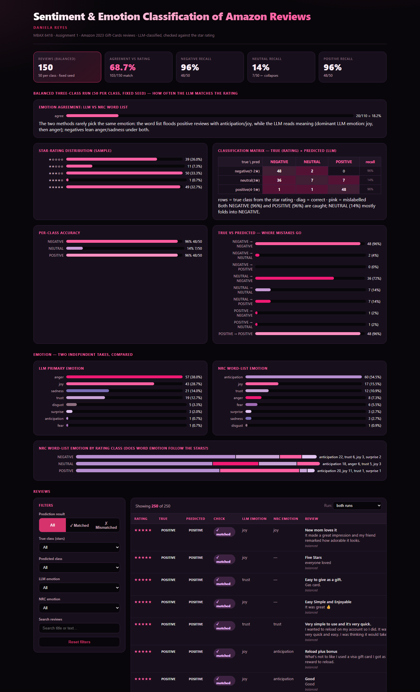

# Sentiment & Emotion Classification of Amazon Reviews

**MBAX 6418 — Assignment 1** · Daniela Reyes · University of Colorado

A working review-sentiment classifier for **Amazon 2023 "Gift Cards"** reviews. It:
1. classifies each review as **positive / neutral / negative**,
2. detects the review's **primary emotion** two independent ways (**LLM** and an **NRC word list**) and compares them,
3. **checks its predictions against the star rating**, and
4. presents everything in a polished, interactive, single-file **dashboard**.

The classification is driven by an **LLM through an OpenAI-compatible endpoint** (Hermes Agent's configured provider), never shown the star rating.

---

## Data

**Source:** Amazon Reviews '23 — a large-scale dataset of product reviews collected by the **McAuley Lab** (UC San Diego). See the dataset site: <https://amazon-reviews-2023.github.io>

- Category file: `review_categories/Gift_Cards.jsonl.gz`
- **152,410** gift-card reviews in the category (each line = one review).
- Fields used: `rating`, `title`, `text`, `verified_purchase`, `helpful_vote`, `timestamp`, `images`, `asin`, `parent_asin`, `user_id`.

The raw reviews are **not** committed to this repo (large and re-downloadable). The cleaned, model-scored results are in `outputs/`.

### "Correct answer" from the rating (the model never sees it)

| Rating | Class |
|---|---|
| 4–5 | **POSITIVE** |
| 3 | **NEUTRAL** |
| 1–2 | **NEGATIVE** |

For the early binary check (Step 2): `rating >= 4 → POSITIVE`, else `NEGATIVE`.

---

## Method & files

| File | Purpose |
|---|---|
| `prompt.py` | The reusable, structured LLM prompt (title + text → sentiment + emotion) and its JSON parser. The prompt never references the rating. |
| `llm_classify.py` | Runs the LLM over a chosen sample; scores predictions vs the rating; saves raw JSONL + results |
| `nrc_emotion.py` | Scores each review against the **NRC emotion word list**; compares it with the LLM emotion |
| `make_dashboard.py` | Generates the self-contained HTML dashboard |
| `spot_check.py` | Quick sanity check on obvious reviews (Step 1) |
| `Sentiment_Emotion_Dashboard.html` | The final dashboard (single file, offline) |
| `outputs/` | Raw run JSONL + scored CSVs/parquets |

The LLM endpoint is the OpenAI-compatible provider configured in Hermes Agent
(`http://dobolyi.com:9000/v1`, model `DeepSeek-V4-Flash-0731`). Model calls use
the review **title and text only**; the rating is applied afterwards purely for scoring.

### Step 1 — structured prompt (spot check)

`spot_check.py` ran the prompt on six obvious reviews (positive, negative, mixed). All six came out right, e.g.:

| Title / text | Expected | LLM | LLM emotion |
|---|---|---|---|
| "Great gift" / "Having Amazon money is always good." | POSITIVE | POSITIVE | joy |
| "Card never arrives" / "I ordered last month and still nothing came." | NEGATIVE | NEGATIVE | anger |
| "Directions confusing" / "The wallet setup is confusing…" | NEGATIVE | NEGATIVE | sadness |

---

## Results

### Step 2 — binary check on the first 100 rows

The first 100 reviews in file order — this set is **heavily lopsided** toward high ratings:

```
true\pred     NEGATIVE  POSITIVE   hit%
NEGATIVE            6         1   85.7%   (n=7)
POSITIVE            1        92   98.9%   (n=93)
```

- **Agreement with rating: 98 / 100 = 98%**
- Only **7 of the 100** were truly negative → a lopsided, mostly-positive set.
- The model looks very accurate here — *because the data is overwhelmingly ★★★★★*, not because the task is easy (the trap the assignment warns about).

### Step 6 — balanced three-class run (50 per class, fixed seed)

To stop the rare classes being drowned out, I drew a **balanced** sample — roughly 50 each of NEGATIVE, NEUTRAL, POSITIVE — from the whole file with a **fixed seed (42)** so the same set reproduces every time.

```
true\pred     NEGATIVE  NEUTRAL  POSITIVE   hit%
NEGATIVE           48        2         0   96%   (n=50)
NEUTRAL            36        7         7   14%   (n=50)
POSITIVE            1        1        48   96%   (n=50)
```

- **Agreement: 103 / 150 = 68.7%**
- NEGATIVE **96%** and POSITIVE **96%** are well-caught.
- **NEUTRAL collapses: only 14%** — **72% of 3-star reviews were labelled NEGATIVE**.
- Balancing flatly revealed what the lopsided run hid: **the model does not give 3-star neutral its own class; it folds into negative.** The 98% binary figure was an artefact of a skewed sample.

### Step 5 — primary emotion: LLM vs NRC word list

Two independent takes:

1. **LLM** — the same structured prompt's emotion field (NRC 8-emotion set).
2. **NRC word list** — terms in each review scored against the NRC Word-Emotion Lexicon (EmoLex), highest sum wins. No model calls.

Emotion distributions (balanced 150):

| Emotion | LLM | NRC word list |
|---|---|---|
| anger | 57 | 8 |
| joy | 43 | 17 |
| sadness | 21 | 3 |
| trust | 19 | 12 |
| anticipation | 1 | **60** |
| disgust / fear / surprise | 9 | 10 |

**Agreement where both assigned an emotion: 20 / 110 = 18.2%.**

They mostly don't agree, and it's easy to see why:
- The **word list is superficial** — it floods positive gift-card reviews with **anticipation** (60) because words like *gift / great / money / enjoy* carry an anticipation/joy/trust tag in NRC. It also misses meaning, negation and idiom.
- The **LLM reads the meaning** — on the same reviews it says **joy** (43) and **anger** (57), and its emotions actually follow the review's content (anger/sadness on negatives, joy on positives).

So the two methods share vocabulary-level signals but diverge on anything requiring context — the word list is a crude baseline, the LLM is the more useful signal.

---

## Reproduce

```bash
uv venv .venv --python 3.11
uv pip install pandas pyarrow transformers torch scikit-learn matplotlib seaborn openai nrclex

# 1. prepare data (downloads/parses Gift_Cards review file)
python 01_prepare_data.py

# 2. binary check (first 100)
python llm_classify.py --mode binary --n 100

# 3. balanced three-class run (50/class, seed 42)
python llm_classify.py --mode three --per 50 --seed 42

# 4. add + compare NRC word-list emotion
python nrc_emotion.py --mode binary
python nrc_emotion.py --mode three

# 5. build the dashboard
python make_dashboard.py
```

> The LLM call reads `BASE_URL` / `API_KEY` / `MODEL` at the top of `llm_classify.py` — point them at any OpenAI-compatible endpoint (the assignment's fixed choice) and set the same values in `spot_check.py`.

## Issues hit along the way

- **LLM sometimes returned empty `content`** — this model puts reasoning in a separate field; when the token budget was tight the answer (`content`) came back empty and only `reasoning` survived. Fixed by raising `max_tokens` to 1024 and falling back to the reasoning field if `content` is empty.
- **pandas 3.x `groupby().apply()` drops the grouped column** — the sentiment label column vanished during sampling. Fixed by building the balanced sample with a robust suffix (and recovering labels from the kept name column).
- **NRC agreement denominator bug** — `NaN` is truthy in Python, so a check that said "both have an emotion" was silently counting records where the NRC emotion was missing, inflating the denominator (showed 20/150). Fixed by filtering with `.notna()`; the true figure is **20/110 = 18.2%**, and the dashboard matches the saved output.
- **GitHub Pages subfolder** — Pages only natively serves from `/` or `/docs`; the project lives in `assignment-1/`, so I deployed it with a GitHub Actions workflow (`upload-pages-artifact` on the `assignment-1` path) instead of the simple dropdown.
- **Dashboard chart layout** — the earlier draft gave thin bars a zero-ish width via a CSS label interaction; switched bar rows to a flex track/fill so even tiny values render a visible sliver.

## Dashboard

`Sentiment_Emotion_Dashboard.html` — one self-contained file (data embedded as JSON), **works offline, no server, no network**. Open by double-clicking or view the hosted copy (GitHub Pages).



It shows:
- **KPI cards** — balanced-set agreement (68.7%), per-class recall (negative 96% / neutral 14% / positive 96%).
- **Descriptive views** — star-rating distribution, the true×predicted classification matrix, per-class accuracy, and a "where mistakes go" breakdown.
- **Emotion views** — LLM emotion, NRC emotion, and NRC-by-class, plus the 18.2% agreement banner.
- **Interactive filtering** — filter reviews by correct/mismatched, true/predicted class, either emotion, or free-text search, with a live count and the explicable review rows underneath.

---

### Data citation

Amazon Reviews '23, McAuley Lab, UC San Diego — <https://amazon-reviews-2023.github.io>. Category: *Gift Cards* (`Gift_Cards.jsonl.gz`).
